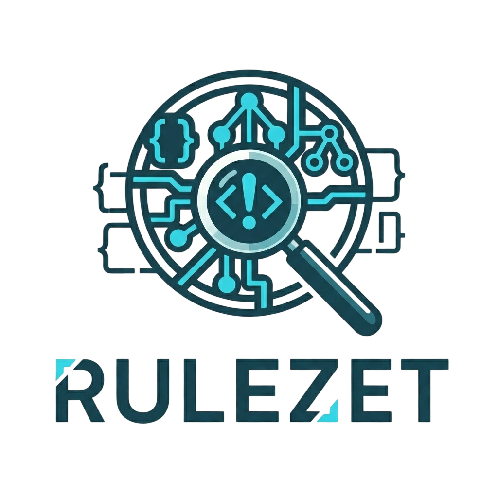

# RULEZET

<p align="center">
  
</p>

**Rulezet** is an open-source web platform for sharing, evaluating, improving, and managing cybersecurity detection rules (YARA, Sigma, Suricata, etc.). It fosters collaboration among security professionals and enthusiasts to improve the quality and reliability of detection rules.

Available as an online service at [https://rulezet.org/](https://rulezet.org/)

---

## Technology Stack

- **Flask** (Python)
- **Vue.js 3** (Composition API, ES modules)
- **Flask-Login** — authentication
- **Flask-SQLAlchemy** — ORM
- **Flask-RESTX** — REST API + Swagger UI
- **SQLite** (dev) / **PostgreSQL** (prod)

---

## Getting started

**Prerequisites:** Python 3.10+, pip

```bash
# First-time setup — creates the venv, installs deps, and seeds the database
./launch.sh --setup

# Start the development server
./launch.sh --start
```

Dev server: `http://127.0.0.1:7009` — Admin: `admin@admin.admin` / `admin`

---

## Commands

| Command | What it does |
|---|---|
| `./launch.sh --setup` | First run: venv, deps, initial database |
| `./launch.sh --start` | Start the development server |
| `./launch.sh --test` | Run the full pytest suite |
| `./launch.sh --test -v tests/<feature>/` | Targeted tests |
| `./launch.sh --migrate "description"` | Generate a new Alembic migration |
| `./launch.sh --upgrade` | Apply pending migrations |
| `./launch.sh --reload-db` | Drop and recreate the database |

---

## Features

- **Detection rules** — Create, edit, delete, version, and validate YARA / Sigma / Suricata rules
- **Community collaboration** — Propose edits (PR-style), comment, evaluate, and discuss rules
- **GitHub integration** — Import rules from public repositories
- **Role-based access control** — Admin, Editor, Read-only with granular permission keys
- **REST API** — Full API at `/api/` with Swagger UI, authenticated via `X-API-KEY`
- **Background jobs** — Long operations (imports, bulk actions) run as tracked background jobs
- **Tag system** — MISP taxonomies and galaxies as structured tags
- **Per-user settings** — Theme, navigation layout, toast preferences
- **Structured logging** — Every mutating action produces a searchable log entry

---

## Project structure

```
app/
  features/          Flask blueprints — one folder per feature
  api/               Flask-RESTX resources
  core/
    db_class/        SQLAlchemy models
    utils/           Decorators, logger, job runner, mailer
  templates/         Jinja2 templates
  static/
    css/             One file per feature + core design system
    js/
      constants.js   TOAST, CSRF_TOKEN, apiFetch()
      toaster.js     create_message()
      components/    Vue 3 reusable components

tests/               Pytest suite mirroring features/ structure
modules/             MISP taxonomies and galaxies (git submodules)
```

---

## Developer reference

Coding conventions, architecture patterns, logging guide, component documentation, and the new-feature checklist are in [`CLAUDE.md`](CLAUDE.md).
